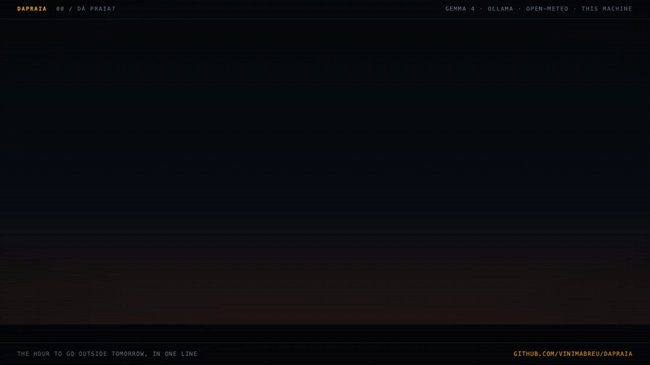

# dapraia

[](https://github.com/vinimabreu/dapraia/actions/workflows/tests.yml)

"Dá praia?" is what people in Rio and Niterói ask the night before: is tomorrow a beach day? dapraia answers it in one line. It picks the hour to go out from an open forecast and from how you like it, said in your own words, and a model running on your own machine explains the pick.



```text
Dá praia amanhã (qua 07/10): Piratininga, das 6h às 9h. A maré baixa às 7h10 e o vento está bem fraco, então o céu encoberto não atrapalha nada.
```

*Beach day tomorrow (Wed 07/10): Piratininga, 6 to 9 am. Low tide at 7:10 and the wind is very light, so the overcast sky won't get in the way.*

That is the whole screen time. You read one line in the evening (or get it as a push notification) and go.

## How it works

The work is split. A model reads and writes words; plain code decides.

**1. You say how you like it, once.**

```sh
dapraia plan "futevôlei de manhã cedo, pouco vento, sem chuva, e maré baixa pra areia ficar firme. Pelo menos 2 horas." \
  --spot "Piratininga:-22.9553,-43.0809" --spot "Itacoatiara:-22.9749,-43.0320"
```

[Gemma 4](https://ollama.com/library/gemma4), served by Ollama on your machine, turns that into rules a forecast can be checked against, and shows you what it read before anything is saved:

```text
Entendi assim:
  atividade    futevôlei                            ← "futevôlei"
               a partir das 6h                      ← "de manhã"
               até as 9h                            ← "cedo"
               vento até 15 km/h                    ← "pouco vento"
               chance de chuva até 20%              ← "sem chuva"
               maré baixa                           ← "maré baixa"
               pelo menos 2h seguidas               ← "Pelo menos 2 horas"
  não sei medir: "pra areia ficar firme"
  lugar: Piratininga (-22.9553, -43.0809)
  lugar: Itacoatiara (-22.9749, -43.0320)
Salvar? [s/N]
```

Every rule carries the exact words it came from, and [`rules.py`](dapraia/rules.py) keeps a rule only when:

- those words are in what you wrote, word for word, inside one sentence, and there are at most eight of them;
- a number in those words is the number the rule uses, converted from the unit written right after it: "vento até 12 km/h" can't become 15, "15 mph" becomes 24 km/h, in "entre 15 e 25 nós" both numbers are knots, so only 28 and 46 km/h pass, and a unit of another kind ("20%" for a wind limit) is refused;
- a clock time keeps its side and its half hour: "a partir das 7h30" can't start at 7:00, "5 da tarde" and "5:30pm" are 17:00 and 17:30, "12 da noite" is midnight, "40 minutos" of play needs a whole hour of window, and a quote that stops at "a partir das 7" when you wrote "7 e meia" is dropped. The spellings it reads are 7h30, 7:30, 7h30min, 19:30h, 7 e meia, 7h e meia, half past 7, and "7 e 30" after a time word ("às 7 e 30"), each with am/pm or "da manhã/tarde/noite" after it; "entre 10 e 15 km/h" stays a range of speeds. A time written another way in digits is reported as a number no rule used, so you see it; a time written only in words ("sete e meia") has no digits to check, so its value is only on the screen for you to read;
- the value is in range, and it doesn't contradict another rule (a minimum above its maximum, gusts below the wind).

Then the check runs the other way: every number you wrote has to be the value of some rule, or sit in the list of things the plan can't measure. Two more checks close the two ways I found for the model to put its own number in place of yours: a number with a unit some rule measures ("12 km/h") can't be filed under things the plan can't measure, and a rule that quotes only words ("vento") next to an unused number of its kind ("vento até 12 km/h", or "pouco vento, até 12 km/h") is dropped.

Before you save, the plan also flags a rule whose words seem to point the other way: "acima de 30 km/h" saved as a maximum, "nunca acima de 15" or "pouco vento" saved as a minimum. That reading comes from lists of phrases ("acima de", "pelo menos", "ou mais", "never more than", "pouco", "forte"...) with negations, so it can be wrong both ways. It is a note for you, never a reason given to the model: an early version used it to reject the model's answer, and the model "fixed" a correct maximum into a wrong minimum to get past it. If the model's answer breaks any of this, it is asked once more with the problems listed; what still fails is left out and shown to you. Vague words ("pouco vento", "no rain", "late afternoon") become numbers the model picks, and you see each one next to the words it came from, so you can change it.

**2. Code picks the window.** The forecast comes from [Open-Meteo](https://open-meteo.com): wind, gusts, rain chance, temperature, UV and cloud everywhere, and waves, sea temperature and the modelled sea level on the coast. No key, no account. [`pick.py`](dapraia/pick.py) checks every hour you asked for, in daylight and not already gone, against every rule, finds the stretches that pass for long enough, and ranks them by how much room they leave inside your limits, across all your spots. Low and high tide times come from the sea level series ([`tide.py`](dapraia/tide.py)).

**3. One line.** The headline (go or not, where, from when to when) is always written by code. Gemma writes only the sentence after it, the why, from facts the code has already put in words: each condition with how much room it leaves, where the tide falls in the window, and the cloud cover. [`line.py`](dapraia/line.py) checks the sentence before you see it. Every number, clock time, date and day in it must be in those facts. A number followed by a unit (km/h, knots, mph, %, mm, m, ft, degrees, minutes, hours) must appear in the facts with that same unit, and a capitalised name in mid-sentence must be one the facts mention. A low tide can't become a high one, and sunny words from a list ("sol", "ótimo", "céu azul", "sunny"...) are refused unless the sky in the facts is clear. Common numbers written out in words (from a list: "quinze", "an hour", "meia hora"...) are refused, since they can't be checked. It has 160 characters at most. A list of phrases that would turn the verdict around ("não dá", "eu não iria", "don't go" on a go day; "dá pra ir", "pode ir", "can still go" on a no-go day) is refused too. Those lists catch the common ways of saying it, not every way. A sentence that fails gets one retry with the problems listed, and after that you get the code's own sentence. On a day with no window, the line says what blocks it and when the next window is. On a day the forecast doesn't reach, it says so instead of guessing.

**4. After the beach, say how it went.**

```text
$ dapraia fui "ventou bem mais do que dizia, umas rajadas chatas, e às 8h30 a areia já tava mole" --day 2026-10-07
(comparando com a escolha de 2026-10-07: Dá praia amanhã (qua 07/10): Piratininga, das 6h às 9h. ...)
Mudaria assim:
  vento até 15 km/h  →  vento até 12 km/h   ← "ventou bem mais do que dizia"
  (nada)  →  rajadas até 14 km/h   ← "umas rajadas chatas"
  até 2h antes ou depois da maré (padrão)  →  até 1h antes ou depois da maré   ← "às 8h30 a areia já tava mole"
  (conta do código: 8h30 fica 1h20 depois da maré baixa das 7h10, então até 1h)
Aplicar? [s/N]
```

Every pick is kept by day, with every number the forecast gave for those hours, and `fui` (or `went`) compares what you say with the forecast for the day you went: today by default, or `--day`, and it says which pick it is using. Without a pick for that day, it borrows the previous day's live pick, with a note and without any tide sums; picks made from saved forecasts (`--forecast-dir`) are never borrowed. That is how "umas rajadas chatas" (some annoying gusts) became a gust limit of 14 km/h on a morning whose gusts went from 8 to 14 (13 or 15 on other runs; you see the number and decide). Gemma proposes the changes, each one quoting your words, and a change that contradicts the rest of the plan (a gust limit under the wind limit) is dropped. When the words put a time on the tide in digits or in a few common phrases ("às 8h30", "1h30 depois", "meia hora depois"), the arithmetic is the code's, in the direction Gemma proposed: soft sand at 8:30, an hour and twenty minutes after a 7:10 low tide, makes the window tighter, so it becomes the last half hour before that moment, one hour. "Umas 2h depois da maré", "depois de 1h e meia" and "around 2 hours after the low tide" are read as spans, not as 2 am; "às 4 da tarde", "at 9 pm" and "às 8 e meia" are read as 16:00, 21:00 and 8:30, and a late time is compared with that night's or the next morning's tide. If the sum would move the window the other way from the proposal, the proposal stays and a note says so. It fails closed. The sum is made only when the time is read with certainty: nothing time-like right after it ("8.30", "8 e dez", "de noitinha" all stop it), no part of the day said elsewhere in your sentence that the reading didn't take in, one time in the quote, not readable as a span too ("às 2h depois da maré"), and not as easily morning as evening (it goes by the hours of that day's window). Otherwise a note says no sum was made, so Gemma's number is never shown as checked. If a change swaps low tide for high, the tide shift, measured for the other kind, is reset to 0 with a note. Nothing changes until you say yes, and the plan keeps a history of every change with the words that caused it.

## Install

You need Python 3.10 or newer. For the plan and for the model's sentence you also need [Ollama](https://ollama.com) and the model:

```sh
ollama pull gemma4:12b
pipx install git+https://github.com/vinimabreu/dapraia
```

dapraia has no Python dependencies, so `git clone` and `python3 -m dapraia` work too. The daily pick runs without the model: with `--no-model`, or when Ollama isn't running, the code writes the whole line.

## Use

```sh
dapraia plan "how you like it" --spot "Name:lat,lon"   # once; --lang en for English lines
dapraia                                                # tomorrow
dapraia --day today                                    # or a date inside the forecast
dapraia --why                                          # the hours behind the pick
dapraia fui "how it went"                              # also: dapraia went "...", --day yesterday
dapraia tide-shift 60                                  # move the model's tides, see "About the tide"
dapraia show                                           # the plan as it is now
```

The plan lives in `~/.config/dapraia/plan.json`, and it is plain JSON you can edit; a mistake in it is reported in one line. The forecast covers 4 days by default (`--days` asks for more). To get the line on your phone every evening, install the [ntfy](https://ntfy.sh) app, subscribe to a topic with a name nobody would guess, and add a cron line:

```cron
0 20 * * * $HOME/.local/bin/dapraia --ntfy your-hard-to-guess-topic
```

Cron runs with a short `PATH`, so use the full path that `command -v dapraia` prints (pipx puts it in `~/.local/bin`).

ntfy is open source and needs no account. Anyone who knows a topic's name can read it, which is why the name matters; you can also run your own ntfy server and pass `--ntfy-server`.

To try it without a plan of your own, the repository has one (written by Gemma from the sentence above, with the tide shift below) and a saved Open-Meteo answer for three beaches in Niterói:

```sh
dapraia --plan examples/plan.json --forecast-dir examples/forecast --why
```

The full output, including `fui`, is in [`examples/demo-output.txt`](examples/demo-output.txt). The model's sentence and its `fui` proposals are written fresh on each run, so yours may read differently (a gust limit of 13 or 15 instead of 14, say) and still pass the same checks. Demo picks are kept apart from your own and only count for the exact plan they were made with, so trying it never touches what `fui` compares with.

## About the tide

Open-Meteo computes tides with a numerical model on a grid of about 8 km and says so in its documentation: accuracy at the coast is limited, and it is not for navigation. So I checked it. For October 6 to 9, 2026, I compared the recorded forecast for Piratininga with the Brazilian Navy's official tide table for Ilha Fiscal, the station for the port of Rio de Janeiro, across the bay from these beaches. Every one of the model's eight low tides came early, by 53 to 69 minutes, and its high tides came 21 to 39 minutes early. The model's own point inside Guanabara Bay showed the same hour for the lows, so it isn't just the difference between the bay and the open sea.

A steady error is the good kind: one number fixes it, for the tide your rule is about. The plan carries a tide shift, set once, and it moves only that kind of tide:

```sh
dapraia tide-shift 60
```

With 60 minutes, all eight low tides land within 10 minutes of the Navy's table. The high tides would then be 21 to 39 minutes late, which is why the shift is for the tide in your rule and not for both. The table and the check are in the repository ([`examples/tide-check`](examples/tide-check/ilha-fiscal-2026-10.csv), [`tests/test_tide_vs_navy.py`](tests/test_tide_vs_navy.py)), so the claim reruns with the tests. For your own coast, compare a few days of `dapraia --why` with your official table.

Tide times are rounded to 10 minutes, and `--why` says how far the model's grid point is from your spot (4.5 km for Piratininga, 7.5 km for Itacoatiara). The tide in the line is there to plan a game on the sand, not to steer a boat.

## What stays on your machine

What you say about your plans (the places, the hours, who you go with) goes to the model on your own machine. The model client only talks to Ollama on this machine unless you pass `--allow-remote-model`, and it ignores proxy settings, so the prompt can't take a detour. Open-Meteo receives the coordinates of your spots, because a forecast can't be made without them. With `--ntfy`, the daily line itself (the spot's name and the hours) goes to the ntfy server you chose, where anyone with the topic's name can read it. Without it, nothing else leaves.

## What it does not do

- It reads a forecast, and forecasts miss. The line is as good as the forecast it read that evening.
- Rules cover what a forecast measures. "Firm sand", "not crowded" and "near my place" are listed as things it can't measure, not guessed at.
- The model picks numbers for vague words. You see each one before it is saved, and it can still be a number you wouldn't have picked.
- The sentence check makes sure each number is in the facts, not that it is used for the same thing: "vento de 15 km/h" would pass when 15 is your limit and the forecast says 4.
- The sentence check catches numbers, units, times, days, names and tides that aren't in the facts, plus the phrases on its lists. A sentence can still say something no fact backs in words the lists don't know ("bastante espaço para jogar", plenty of room to play), and the check can't tell a dull sentence from a good one.
- Wave and tide data come from the nearest point of a model grid, which can be a few kilometres offshore or inside a bay.

## Tests

```sh
pip install pytest
python -m pytest
```

344 tests: every rule check against quotes that are and are not in the text, numbers that match and don't, units (knots, metres per second, feet, Fahrenheit, and "no" that is not "nó"), numbers pointing the wrong way (negations included, as warnings), units of the wrong kind, contradicting rules and unused numbers; the window picker on synthetic days (wind picking up, rain, short stretches, weekdays, daylight, low tide, hours already gone, time zones); a real Open-Meteo answer for three beaches, and the tide claim above against the Navy's table; the sentence check against sentences that invent numbers, times, dates, days and places or contradict the verdict; the tide arithmetic after an outing (clock times with pm and "e meia", spans, the wrong direction, a neighbouring day); the command line end to end with a fake model. None of them needs Ollama or the network, and a test that tries to reach the network fails.

The reading step is also measured across models, outside this repo. [Keep the number you wrote](https://www.kaggle.com/benchmarks/vinimabreu/keep-the-number-you-wrote) is a public Kaggle benchmark built from the readings that went wrong here, such as knots read as km/h: 40 plan sentences, eight models, two prompts, every rule graded against a hand-checked key ([write-up](https://dev.to/vinimabreu/keep-the-number-you-wrote-40-beach-plans-8-models-and-where-the-knots-went-3fl2)).

## Credits

Forecast data by [Open-Meteo.com](https://open-meteo.com), under CC BY 4.0. Open-Meteo is open source (AGPL-3.0) and can be self-hosted. Tide predictions for the check above come from the Brazilian Navy's tide tables (Marinha do Brasil, Centro de Hidrografia da Marinha), 2026 edition. The example coordinates come from [OpenStreetMap](https://www.openstreetmap.org/copyright). Push notifications go through [ntfy](https://ntfy.sh). The model is Gemma 4, served by [Ollama](https://ollama.com).

## License

MIT
